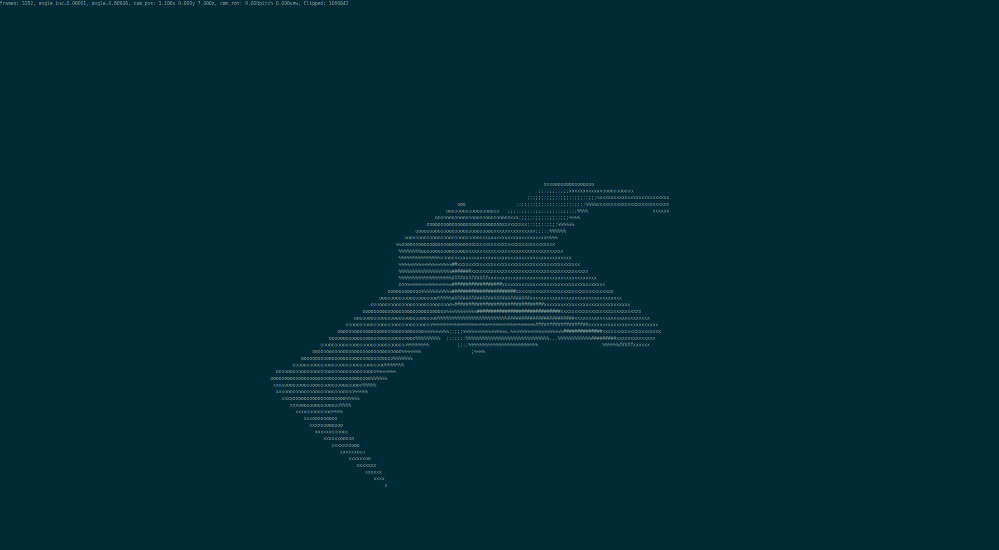

# 3D ASCII Renderer in the Terminal

Developed by Alok Gupta

This project is an ASCII renderer designed to run in the terminal environment, leveraging the ncurses library for graphical output. It offers users a unique and retro visual experience by rendering 3D models using ASCII characters.

## Features

* **ASCII Rendering**: Display 3D meshes in the terminal using ASCII art.
* **Lighting and Shading**: Support for basic lighting and shading techniques to enhance object visibility.
* **User Interaction**: Users can control the camera and object rotation interactively.
* **Model Loading**: Ability to load custom 3D object models for visualization.

## Installation

*This project was developed on a Linux-based system and is intended to be used in a terminal environment.*
1. Clone the repository: 
2. Ensure the required dependencies are installed, including `pthread` and `ncurses`.
3. Compile the project using the provided Makefile: `make all`. Adjust the compiler settings as needed.
4. Set your terminal font to a **monospace** font and scale it down as much as possible while in fullscreen mode.
5. Run the renderer using `./bin <mesh-path>` (the mesh file is optional).

## Usage

1. **Movement**: Use `WASD` keys to move the first-person camera.
2. **Camera Angle**: Use the `arrow keys` to adjust the camera angle.
3. **Speed Control**: Press `q` to slow down the rotation of the object, or `e` to speed it up.
4. **Quit**: Press `ctrl-c` to exit the program.

#### Mesh Creation
Meshes must be composed of triangles. Refer to the example meshes provided in the `/meshes` directory.  
To export a mesh from Blender:
1. Create an object in Blender, ensuring it is at the correct scale.
2. Navigate to `File -> Export -> Wavefront (.obj)`.
3. In the export settings, deselect all options except for `Triangulate faces`.
4. Set the `Forward` option to `Z forward`.
5. Export the object.

## Screenshots

Utah Teapot: This model contains approximately 10k triangles (GIF loading required):

Simple Ship Object: This model contains fewer triangles and uses a larger font, resulting in lower quality:

## What's Next?

While this project is functional, it is not yet complete. There is room for improvement in the rasterizing and rendering processes. Future enhancements could include adding features like face culling and clipping, refining drawing algorithms, implementing better lighting techniques, introducing color support, and transforming the renderer into a fully functional tool suitable for games and other applications.  
Though development may not continue immediately, there's potential for future updates and improvements.